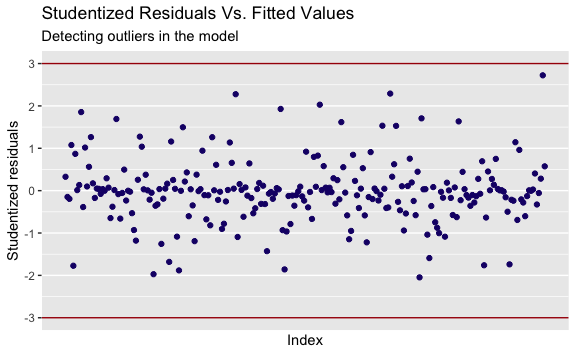

Decoding EEG During Action Observation, Motor Imagery, & Motor Execution
================
Evan Woods
2024-01-05

## Support Vector Classifier Results

### Motor Imagery While Sitting: Detection of Resting vs Action Observation

    Subject 1:
         pred
    truth  0  1
        0 10  2
        1  0 10
    Accuracy: 90.909%

    Subject 2:
         pred
    truth  0  1
        0  5  3
        1  3 11
    Accuracy: 72.727%

    Subject 3:
         pred
    truth  0  1
        0 12  0
        1  2  8
    Accuracy: 90.909%

    Subject 4:
         pred
    truth  0  1
        0 11  0
        1  1 10
    Accuracy: 95.455%

    Subject 5:
         pred
    truth  0  1
        0 13  1
        1  0  8
    Accuracy: 95.455%

    Subject 6:
         pred
    truth  0  1
        0 10  2
        1  2  8
    Accuracy: 81.818%

    Subject 7:
         pred
    truth  0  1
        0 10  0
        1  2 10
    Accuracy: 90.909%

    Subject 8:
         pred
    truth  0  1
        0 10  3
        1  1  8
    Accuracy: 81.818%

    Mean Accuracy: 87.500%.
    Standard Error: ±7.966%.

### Motor Imagery While Sitting: Detection of Action Observation vs Motor Imagery

    Subject 1:
         pred
    truth  0  1
        0 13  0
        1  0  9
    Accuracy: 100.000%

    Subject 2:
         pred
    truth  0  1
        0 11  0
        1  2  9
    Accuracy: 90.909%

    Subject 3:
         pred
    truth  0  1
        0 11  1
        1  1  9
    Accuracy: 90.909%

    Subject 4:
         pred
    truth  0  1
        0 13  0
        1  0  9
    Accuracy: 100.000%

    Subject 5:
         pred
    truth  0  1
        0 14  0
        1  1  7
    Accuracy: 95.455%

    Subject 6:
         pred
    truth  0  1
        0 12  2
        1  0  8
    Accuracy: 90.909%

    Subject 7:
         pred
    truth  0  1
        0 10  0
        1  0 12
    Accuracy: 100.000%

    Subject 8:
         pred
    truth  0  1
        0 13  2
        1  0  7
    Accuracy: 90.909%

    Mean Accuracy: 94.886%.
    Standard Error: ±4.505%.

### Motor Imagery While Standing: Detection of Resting vs Action Observation

    Subject 1:
         pred
    truth  0  1
        0 13  0
        1  0  9
    Accuracy: 100.000%

    Subject 2:
         pred
    truth  0  1
        0  9  0
        1  1 12
    Accuracy: 95.455%

    Subject 3:
         pred
    truth  0  1
        0 13  1
        1  0  8
    Accuracy: 95.455%

    Subject 4:
         pred
    truth  0  1
        0 12  0
        1  0 10
    Accuracy: 100.000%

    Subject 5:
         pred
    truth  0  1
        0 13  1
        1  1  7
    Accuracy: 90.909%

    Subject 6:
         pred
    truth  0  1
        0 10  1
        1  0 11
    Accuracy: 95.455%

    Subject 7:
         pred
    truth  0  1
        0 10  0
        1  0 12
    Accuracy: 100.000%

    Subject 8:
         pred
    truth  0  1
        0 11  0
        1  0 11
    Accuracy: 100.000%

    Mean Accuracy: 97.159%.
    Standard Error: ±3.382%.

### Motor Imagery While Standing: Detection of Action Observation vs Motor Imagery

    Subject 1:
         pred
    truth  0  1
        0 13  0
        1  0  9
    Accuracy: 100.000%

    Subject 2:
         pred
    truth  0  1
        0  8  1
        1  1 12
    Accuracy: 90.909%

    Subject 3:
         pred
    truth  0  1
        0 13  1
        1  0  8
    Accuracy: 95.455%

    Subject 4:
         pred
    truth  0  1
        0 11  1
        1  0 10
    Accuracy: 95.455%

    Subject 5:
         pred
    truth  0  1
        0 13  1
        1  1  7
    Accuracy: 90.909%

    Subject 6:
         pred
    truth  0  1
        0 10  1
        1  0 11
    Accuracy: 95.455%

    Subject 7:
         pred
    truth  0  1
        0 10  0
        1  0 12
    Accuracy: 100.000%

    Subject 8:
         pred
    truth  0  1
        0 11  0
        1  0 11
    Accuracy: 100.000%

    Mean Accuracy: 96.023%.
    Standard Error: ±3.793%.

### Comparision Against Results of Prior Research

    The highest mean accuracy of the classifiers in the prior research is: 82.73%
    with a standard error of ±2.54.

    The lowest mean accuracy of the classifiers is: 87.500% with a standard error of
    7.966%.

    The highest mean accuracy of the classifiers is: 97.159% with a standard error
    of 3.382%.

## Increasing a Subject’s Model Accuracy

    The lowest performing model of the Resting vs. Action Observation
    classifications is the model for subject #2. The accuracy of subject #2's model
    is: 72.727.

## Explore the subject with the lowest performing model’s data and find outliers, high-leverage, or non-linearities.

## Logistic Regression: Training & Validation

              truth
    prediction  0  1
             0 16  4
             1  6 26

    Validation Accuracy of Logistic Regression: 80.769%.

### Detecting Outliers

    There are no detected outliers in the logistic regression fit on the subject
    with the lowest performing model's data.

### Detecting and Removing High-Leverage Values

    There are 16 high-leverage values:

          122        40        33       100        42        54        60       166 
    0.1525843 0.1392962 0.1230248 0.2702669 0.1232194 0.1294163 0.1583125 0.1634064 
          291       190       298       273       209        75        47       105 
    0.1968935 0.2429515 0.1299119 0.1517439 0.1382543 0.1825471 0.1501227 0.1632604 

### Refitting a Logistic Regression Model

              truth
    prediction  0  1
             0 17  2
             1  5 28

    Validation Accuracy of Logistic Regression with no high leverage: 86.538%.

              truth
    prediction  0  1
             0  5  3
             1  3 11

    Accuracy of Logistic Regression on the subject with the lowest performing
    model's Test Data after removing high-leverage: 72.727%. The previous accuracy
    on test data with an SVM was: 72.727%.

### Refitting the Lowest Performing Support Vector Classifier Model

              truth
    prediction  0  1
             0  7  3
             1  1 11

    [1] 81.81818

### Results

    The validation accuracy of the logistic regression model on the subject with
    the lowest performing model's data increased model performance from 80.769% to
    86.538% after removing high-leverage values detected in the subject's training
    data.
